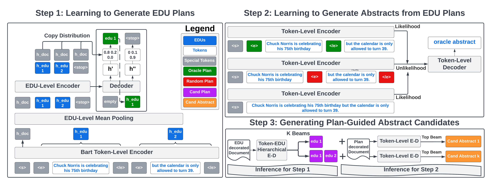

# Generating EDU Extracts for Plan-Guided Summary Re-Ranking

This is the PyTorch implementation of the ACL 2023 Paper: [Generating EDU Extracts for Plan-Guided Summary Re-Ranking](https://arxiv.org/abs/2305.17779).

Please feel free to raise an Issue or directly email `griffin.adams@columbia.edu` with any questions.



# Setup

```
pip install -e .
cd transformers && pip install -e . && cd ../
export DATA_DIR={path for saving data/models/results}
export ROUGE_HOME="{your-desired-path}/ROUGE-1.5.5/"
bash setup_rouge.sh
python -m spacy download en_core_web_sm
export WANDB_API_KEY={a weights & biases API key}
```

If you want to use BRIO re-ranker, please feel README under `./BRIO`. The directory is [borrowed](https://github.com/yixinL7/BRIO) from the original [BRIO paper](https://arxiv.org/abs/2203.16804).

# Preprocess

```angular2html
python preprocess/split_into_sentences.py
[ Run EDU script ]
python preprocess/add_edu.py
python preprocess/align_edu.py
```

# Training

## EDU Extract Generator

```angular2html
python model/main.py --dataset cnn_dailymail --summary_style extract --experiment {my-extract-experiment} --wandb_project {yours} --wandb_entity {yours}
```

## Extract-Guided Abstractor

```angular2html
python model/main.py --summary_style abstract -extract_indicators --dataset cnn_dailymail --mle_weight 1.0 --like_coef 1.0 --unlike_coef 1.0 --experiment {my-abstract-experiment} --wandb_project {yours} --wandb_entity {yours}
```

See [paper](https://arxiv.org/abs/2305.17779) for guidance on setting Hyper-Parameters (`like_coef`, `unlike_coef`, and `mle_weight`). Setting to all `1` will give you reliable performance, and results are not overly sensitive to changes in the coefficients. Generally speaking, `mle_weight > like_coef, unlike_coef` leads to less diversity and less plan adherence.

We select the model (BART or PEGASUS) based on the dataset (BART for NYT and CNN/DailyMail) and PEGASUS for Xsum. When running PEGASUS on Xsum, we recommend changing default hyper-parameters by adding the following: `--lr 1e-4 --target_batch_size 64`.

# Generating Plan-Guided Abstracts

```angular2html
bash model/ea_pipeline.sh {device} {validation,test} {my-extract-experiment} {my-abstract_experiment} {max_examples}
```

EA stands for extract-abstract and performs the two-step generation described in the paper. Manually change `N_CAND=16` in `ea_pipeline.sh` to generate a different number of candidates.

## Re-Rank with BRIO

First we need to convert the plan-guided abstracts to the format expected by BRIO.

```angular2html
bash model/to_brio.sh {my-extract-experiment} {.csv file} {any suffix name}
```

`.csv file` will be the name of the csv file containing `from_beam_16_extract` file under `$DATA_DIR/results/{my-extract-experiment}/{.csv file}`. It will look something like `test_from_beam_16_extract.csv` depending on the split.

The end of the script will provide the specific command in `./BRIO` to run to obtain the final re-ranking results.

# Guiding with GPT

## Setup

Create a file `edu_gpt/oa_secrets.py` that which should look like

```angular2html
OA_KEY = 'sk-xx'
OA_ORGANIZATION = 'org-xx'
```

## Running

```
python edu_gpt/pga_prompts.py --extract_fn {.csv file}
python edu_gpt/run.py --mode pga --candidates 16 --temperature 0.3
```

`{.csv}` file should be the absolute path to a file with extractive candidates: `$DATA_DIR/results/{my-extract-experiment}/test_beam_16_outputs.csv`.

Please email `griffin.adams@columbia.edu` for full test set 16 candidate outputs for `CNN/DM` and `Xsum` if you want to skip [EDU Generation](#EDU-Extract-Generator).
